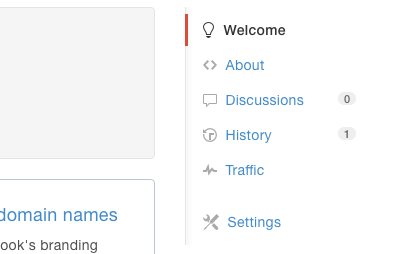
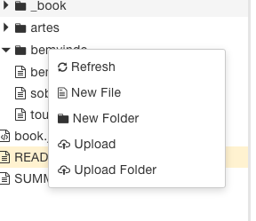

# The Swift Programming Language - Tradução Português (BR)


Esse projeto é uma iniciativa do CocoaHeads Brasil que tem como objetivo de traduzir o livro oficial da Apple para o Swift 2.2

Link do livro original: [Swift.org](http://swift.org/download)

TODO: Melhorar essa descrição e corrigir o link
TODO: Adicionar screenshot com preview do livro no GitBook

---

###Como contribuir?

Basta criar os documentos traduzidos em arquivos *.md* específico, seguindo a estrutura sugerida pelo SUMMARY.md (abrir raw do arquivo para mais detalhes). A formatação do SUMMARY.md é importante, pois ela que gera o

### Como utilizar o GitBook?:

Para a tradução desse livro, estamos utilizando o [GitBook](http://gitbook.com).

O GitBook pode ser instalado utilizando o **NPM**, execute:

```
$ npm install gitbook-cli -g
```

Para criar um arquivo SUMMARY.md com a estrutura básica para o livro, execute:

```
$ gitbook init
```

Você pode iniciar um server local do GitBook (disponível num http://localhost:4000/ ou algo similar), execute:

```
$ gitbook serve
```

Ele vai gerar um servidor local para os seus testes. Caso você queira gerar uma build de um site estático para leitura online do livro, execute:

```
$ gitbook build
```

TODO: Melhorar explicação do GitBook

### Contribuindo via GitBook.com

Você também pode contrbuir através do seu navegador, utilizando a interface gráfica, e ferramentas de edição, oferecidas no site GitBook.com.

Abaixo, segue o breve passo a passo de como contribuir desta maneira, assumindo que você já tenha feito o fork do projeto para sua conta no GitHub:

1. **Crie uma conta no GitBook.com:**

    * Acesse o [GitBook.com](https://www.gitbook.com) e crie uma conta de usuário usando os dados da sua conta no GitHub.
    
    [Imagem](artes/project/tutorials/gitbook_web/figura_0.png)
    
1. **Confirme seu e-mail:**
    
    * Vá até "Your profile" > "Settings" e preencha o campo "email" do seu perfil.
    
    [Imagem](artes/project/tutorials/gitbook_web/figura_1.png)

    * Você receberá um email com o link de confirmação. Confirme-o, isso será importante para os próximos passos.

1. **Importe seu fork:**
    
    * Clique em "Create your first book":
    
    

    * Na barra superior clique em "Import", cole o link do seu fork no primeiro campo e preencha os campos solicitados. Clique em "Create Book":
    
    [Figura 4](artes/project/tutorials/gitbook_web/figura_4.png)
    
1. **Configure o Webhook do GitBook:**
    
    * O Webhook do GitBook irá garantir que as alterações feitas por você sejam encaminhadas para o seu fork e vice-versa.
     
    * Após criado o livro, vá em "Settings":
    
    

    * Na seção "Publication" adicione a url do seu fork no campo "Git URL":
    
    
    
    * Verifique se o webhook foi instalado no seu fork:
    
    
    
1. **Começe a contribuir:**
    
    * Acesse o livro e clique em "Edit". Você será levado para a área de edição do livro:
    
    

    * Na area de edição você encontra as ferramentas de edição de texto (canto superior esquerdo), o explorer de arquivos (lateral esquerda), o painel com o texto *raw* (painel esquerdo) e uma pré-visualização do texto (painel direto):
    
    
    
    * O branch no qual você está contribuindo é mostrado no canto superior diretiro da barra de ferramentas: 
    
    
    
1. **Conclusão:**
    * Ao concluir suas edições você pode salvar seu trabalho clicando em "Save", o icone laranja de um disquete na barra de ferramentas.
    
    * Ao clicar em "Save" um commit será gerado no *branch* que você estiver trabalhando dentro do repositório do seu fork. 
    
    * Quando desejar fazer um *pull request* faça-o, normalmente, pelo site do GitHub.

1. **Preferências:**
    
    * A imagens a baixo mostram algumas das características da interface web do GitBook:
     
    
---

###Licença

TODO: Adicionar licença apropriada
